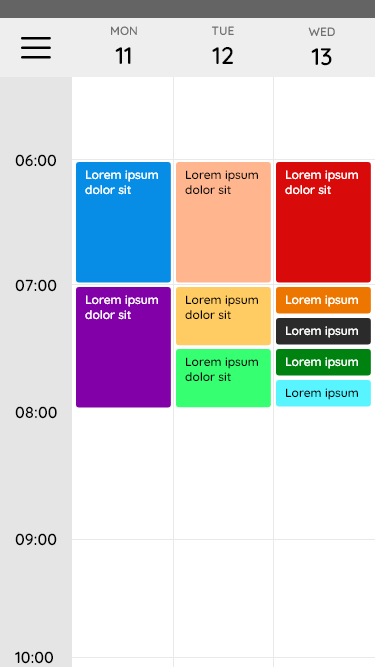
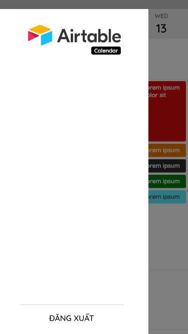

# AirtableCalendar

A Airtable Calendar App for easy view.

## Usage

This project was build with Flutter.

To run:

```bash
flutter run
```

## Table Design

At the first, we must create a new table in Airtable with following structure.

- `Name`: Single line text - Name of task.
- `Start`: Date | ISO | 24 hour - The time to start task.
- `End`: Date | ISO | 24 hour - The time to finish task.
- `Priority`: Integer - 0 to 10 priority levels with 0 is the highest urgent.
- `Done`: Checkbox - Task was done or not.
- `Note`: More info about task.

## UI Design

 